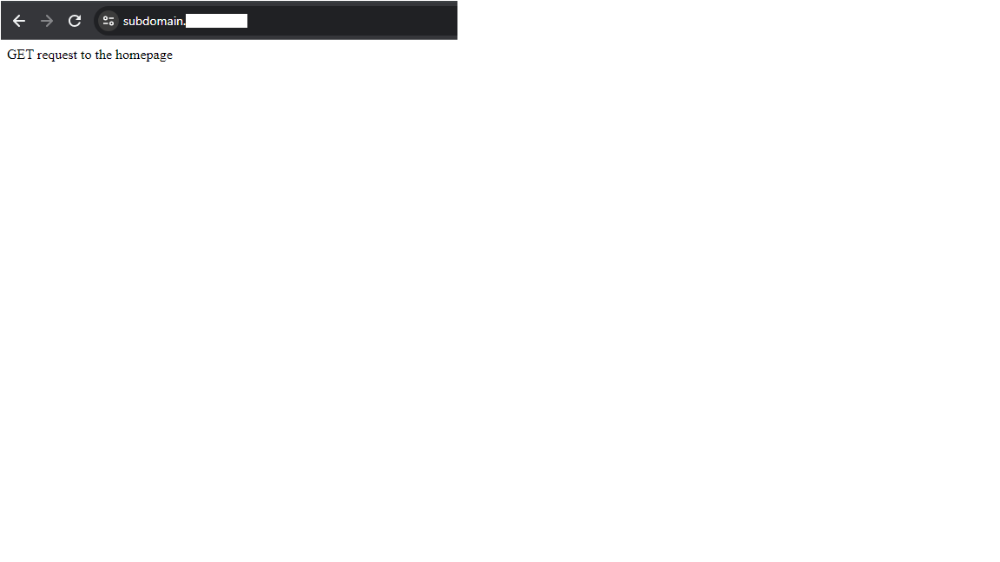
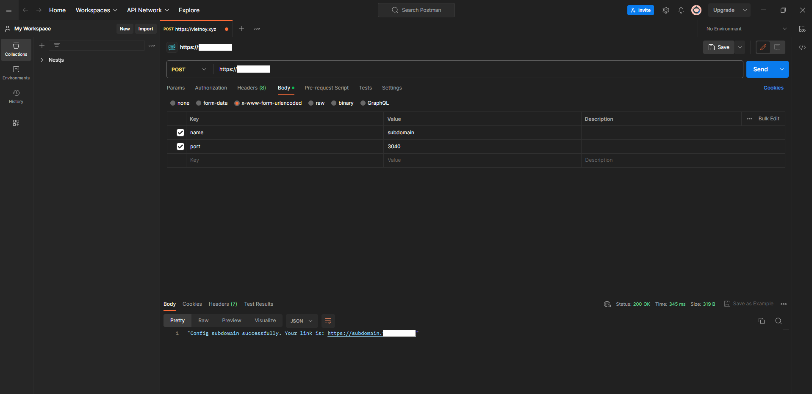
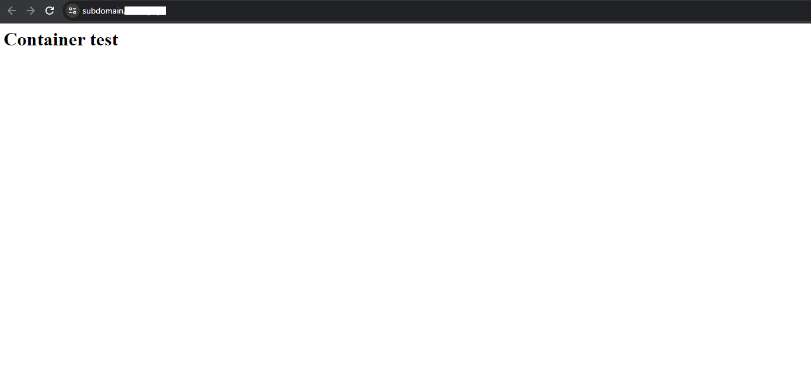

# Cấu hình Dynamic Subdomains có SSL với Docker Container có sẵn trên Nginx


## 1. Môi trường test

1 EC2 với SSH truy cập từ internet:

- Đã cài đặt Nginx, snap, docker, nvm, nodejs.
- Source code app đã chạy trên port 9000
- Đã cấu hình SSL trên domain
- 1 Container port 3040 chạy http server đơn giản
- Postman để gửi request

### Minh họa thực hiện (name: "subdomain", port: 3040)

- Khi chưa gửi request (Vì mình chưa có config cho tên này nên nó sẽ chuyển về domain root)
  

- Gửi request bằng Postman


- Domain được tạo thành công


## 2. Các bước cấu hình

### 2.1 Cấu hình EC2

- Cài đặt snap

```bash
sudo apt install snapd
sudo snap install core; sudo snap refresh core
```

- Cấu hình SSL cho domain

```bash
sudo snap install --classic certbot
sudo ln -s /snap/bin/certbot /usr/bin/certbot
sudo snap set certbot trust-plugin-with-root=ok

```

Trỏ domain về public IPv4 của EC2 bằng A record, sau đó thêm 1 TXT record với name là "_acme-challenge" và giá trị là output của dòng lệnh bên dưới. Sau đó nhập email và đợi đến khi nào có record ở [tool của google](https://toolbox.googleapps.com/apps/dig) thì nhấn Enter để nó lưu.

```bash
sudo certbot certonly --manual --preferred-challenges=dns -d <yourdomain.com> -i nginx
```

Thêm 1 value trong record phía trên để nó tạo SSL cho các subdomain. Cách làm cũng tương tự.

```bash
sudo certbot certonly --manual --preferred-challenges=dns -d <*.yourdomain.com> -i nginx
```

- Cài đặt Nginx

```bash
sudo apt-get install nginx
```

Cấu hình Nginx với nội dung như sau:

``` nginx
# For use in /etc/nginx/sites-available/default

# This directive redirects all(All is denoted by a dot prefix on the domain) HTTP requests of vietnoy.xyz and *.vietnoy.xyz to their HTTPS versions respectively.
server {
  listen 80;
  listen [::]:80;
  server_name .<yourdomain.com>;

  return 301 https://$server_name$request_uri;
}

# This directive tells Nginx to use HTTP2 and SSL. And also proxy requests of https://<yourdomain.com> to a local Node.js app running on port 9000
server {
    listen 443 ssl http2;
    listen [::]:443 ssl http2;
  server_name <yourdomain.com>;

  ssl_certificate /etc/letsencrypt/live/<yourdomain.com>/fullchain.pem;
  ssl_certificate_key /etc/letsencrypt/live/<yourdomain.com>privkey.pem;
  ssl_session_timeout 5m;

  location / {
    proxy_set_header X-Real-IP $remote_addr;
    proxy_set_header X-Forwarded-For $proxy_add_x_forwarded_for;
    proxy_set_header X-NginX-Proxy true;
    proxy_pass http://localhost:9000/;
    proxy_ssl_session_reuse off;
    proxy_set_header Host $http_host;
    proxy_cache_bypass $http_upgrade;
    proxy_redirect off;
  }
}
```

Reload lại Nginx
``` bash
sudo nginx -t
sudo ln -s /etc/nginx/sites-available/default /etc/nginx/sites-enabled/
sudo service nginx reload
```

- Cài đặt docker và tạo test container với port __3040__, 

```bash
# Cài đặt docker
sudo apt update
sudo apt install apt-transport-https ca-certificates curl software-properties-common
curl -fsSL https://download.docker.com/linux/ubuntu/gpg | sudo apt-key add -
sudo add-apt-repository "deb [arch=amd64] https://download.docker.com/linux/ubuntu focal stable"
apt-cache policy docker-ce
sudo apt install docker-ce
sudo systemctl status docker

# Sử dụng docker không cần sudo
sudo usermod -aG docker ${USER}
su - ${USER}
sudo usermod -aG docker username

# Pull image
sudo docker create httpd

# Tạo container
sudo docker run -dit --name container1 -p 3040:80 httpd

# sed dùng để thay đổi chuỗi trong file index.html thành _Container 1_ để dễ phân biệt
sudo docker exec ec2d8f51fbdf sed -i 's/It works!/Container 1/' /usr/local/apache2/htdocs/index.html

# Xóa container
sudo docker stop ec2d8f51fbdf
sudo docker rm -f ec2d8f51fbdf
```

- Cài đặt NVM và Nodejs để chạy app

```bash
curl https://raw.githubusercontent.com/creationix/nvm/master/install.sh | bash
source ~/.bashrc
nvm install 16
npm i
# cd vào thư mục app
npm run start
```

Ý tưởng của app là sử dụng __name__ và __port__ từ API, sau đó tạo file name.conf và di chuyển nó vào thư mục site_available -> reload nginx và trả về đường dẫn tới subdomain.

Tài liệu [ở đây](https://blog.logrocket.com/how-to-build-web-app-with-multiple-subdomains-nginx/)